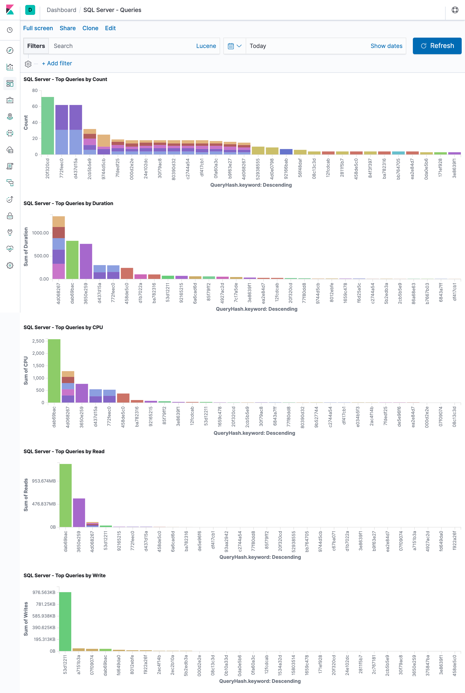

# sqlmon
Collects events from SQL Server and saves them to Elasticsearch for further analysis.

You can use [sqltop](https://github.com/soheilpro/sqltop) or Kibana to analyze these data.

## Installation

```
npm install -g sqlmon
```

## Sample
```
$ sqlmon \
    --ss-address sql.example.com \
    --ss-user sa \
    --ss-password p@ssw0rd \
    --es-address elasticsearch.example.com \
    --trace-directory 'c:\trace' \
    --events RPCCompleted SQLBatchCompleted \
    --fields TextData TextDataHash QueryHash LoginName Duration Reads Writes CPU \
    --duration 60s

Connecting to sql.example.com...
Creating trace...
Trace file path: c:\trace\20190729103344280.trc
Starting trace...
Collecting events for 60s until 14:13:20... (Press [c] to stop)
Stopping trace...
Reading trace...
Saving 18120 events to elasticsearch.example.com...
100.00% 18120/18120
Disconnecting...
```

## Usage
### Trace directory
sqlmon needs to write trace files to a temporary directory on the server first. Use the `---trace-directory` option to specify the location of this directory:
```
--trace-directory 'c:\trace'
```

**Note 1**: The SQL Server service account (usually NT Service\MSSQLSERVER) must have Write permission on this directory.

**Note 2**: These files are not removed when the program ends and must be manually deleted.

### Duration
Use the `--duration` or `-d` parameter to specify the duration that the trace must run:

```
--duration 1m
```

You can use any specifier like `30s`, `10m`, `2h`, or `1d`. The default is `60s`.

### Max trace size
By default, sqlmon limits the size of trace files to 1 GB. You can change this by using the `--max-size` option (in megabytes):

```
--max-size 2048 # 2 GB
```

### Events to capture
Use the `--events` parameter to specify the events to be captured:

```
--events RPCCompleted SQLBatchCompleted
```

See [all supported events](#supported-events-and-fields).

### Fields to include
Use the `--fields` parameter to specify the fields to be included:

```
--fields TextData Reads Writes CPU Duration RowCounts
```

See [all supported fields](#supported-events-and-fields).

### Index name
The default Elasticsearch index name is `sql-YY.MM.DD` which can be changed using the `--index-prefix` option:

```
--index-prefix trace-
```

### Collect only
If you only want to collect events without saving them to Elasticsearch, you can use the `--collect-only` option.

### Importing trace files
If you have a saved trace file (created by either sqlmon or SQL Server Profiler), you can import it into Elasticsearch using the `--import` option:

```
--import 'c:\trace\20190728042508732.trc'
```

### Delayed start
You can use the `--delay` option to delay starting the operations until a later time:

```
--delay 1h
```

### Hooks
There are a few hooks defined that let you run any program at certain stages of the execution:

```
--schedule-hook ./myscript.sh
--collection-start-hook ./myscript.sh
--collection-end-hook ./myscript.sh
--save-start-hook ./myscript.sh
--save-end-hook ./myscript.sh
--error-hook ./myscript.sh
--interrupt-hook ./myscript.sh
```

The following environment variables are available to use in your hooks:
* SQLMON_SQLSERVER_ADDRESS
* SQLMON_SQLSERVER_PORT
* SQLMON_SQLSERVER_USER
* SQLMON_SQLSERVER_PASSWORD
* SQLMON_SQLSERVER_TIMEOUT
* SQLMON_ELASTICSEARCH_ADDRESS
* SQLMON_ELASTICSEARCH_PORT
* SQLMON_ELASTICSEARCH_TIMEOUT
* SQLMON_TRACE_DIRECTORY
* SQLMON_INDEX_PREFIX
* SQLMON_EVENTS
* SQLMON_FIELDS
* SQLMON_DURATION
* SQLMON_MAX_SIZE
* SQLMON_BATCH_SIZE
* SQLMON_DELAY
* SQLMON_COLLECT_ONLY
* SQLMON_IMPORT
* SQLMON_START_DATETIME
* SQLMON_START_TIME
* SQLMON_TRACE_FILE_PATH
* SQLMON_STOP_DATETIME
* SQLMON_STOP_TIME
* SQLMON_TRACE_FILE_PATH
* SQLMON_ERROR

## Computed fields
### TextDataHash
TextDataHash is the hash of the TextData field.

### QueryHash
QueryHash is created by first removing all parameters and variables from TextData and then hashing it. It is useful for grouping queries to find the top resource consuming ones.



## Supported events and fields
See [SQL Server Event Class Reference](https://docs.microsoft.com/en-us/sql/relational-databases/event-classes/sql-server-event-class-reference) for detailed information about these fields and events.

### Events
* AssemblyLoad
* Attention
* AuditAddDBUserEvent
* AuditAddLoginEvent
* AuditAddLogintoServerRoleEvent
* AuditAddMembertoDBRoleEvent
* AuditAddRoleEvent
* AuditAppRoleChangePasswordEvent
* AuditBackupRestoreEvent
* AuditBrokerConversation
* AuditBrokerLogin
* AuditChangeAuditEvent
* AuditChangeDatabaseOwner
* AuditDatabaseManagementEvent
* AuditDatabaseObjectAccessEvent
* AuditDatabaseObjectGDREvent
* AuditDatabaseObjectManagementEvent
* AuditDatabaseObjectTakeOwnershipEvent
* AuditDatabaseOperationEvent
* AuditDatabasePrincipalImpersonationEvent
* AuditDatabasePrincipalManagementEvent
* AuditDatabaseScopeGDR
* AuditDBCCEvent
* AuditFulltext
* AuditLogin
* AuditLoginChangePasswordEvent
* AuditLoginChangePropertyEvent
* AuditLoginFailed
* AuditLoginGDREvent
* AuditLogout
* AuditObjectDerivedPermissionEvent
* AuditObjectGDREvent
* AuditSchemaObjectAccessEvent
* AuditSchemaObjectManagementEvent
* AuditSchemaObjectTakeOwnershipEvent
* AuditServerAlterTraceEvent
* AuditServerObjectGDREvent
* AuditServerObjectManagementEvent
* AuditServerObjectTakeOwnershipEvent
* AuditServerOperationEvent
* AuditServerPrincipalImpersonationEvent
* AuditServerPrincipalManagementEvent
* AuditServerScopeGDREvent
* AuditServerStartsandStops
* AuditStatementPermissionEvent
* AutoStats
* BackgroundJobError
* BitmapWarning
* BlockedProcessReport
* BrokerActivation
* BrokerConnection
* BrokerConversation
* BrokerConversationGroup
* BrokerCorruptedMessage
* BrokerForwardedMessageDropped
* BrokerForwardedMessageSent
* BrokerMessageClassify
* BrokerMessageUndeliverable
* BrokerQueueDisabled
* BrokerRemoteMessageAcknowledgement
* BrokerTransmission
* CPUthresholdexceeded
* CursorClose
* CursorExecute
* CursorImplicitConversion
* CursorOpen
* CursorPrepare
* CursorRecompile
* CursorUnprepare
* DatabaseMirroringStateChange
* DatabaseSuspectDataPage
* DataFileAutoGrow
* DataFileAutoShrink
* DeadlockGraph
* DegreeofParallelism
* Deprecated
* DeprecationAnnouncement
* DeprecationFinalSupport
* DTCTransaction
* ErrorLog
* EventLog
* Exception
* ExchangeSpillEvent
* ExecPreparedSQL
* ExecutionWarnings
* ExistingConnection
* FTCrawlAborted
* FTCrawlStarted
* FTCrawlStopped
* HashWarning
* LockAcquired
* LockCancel
* LockDeadlock
* LockDeadlockChain
* LockEscalation
* LockReleased
* LockTimeout
* LockTimeoutNonZero
* LogFileAutoGrow
* LogFileAutoShrink
* MissingColumnStatistics
* MissingJoinPredicate
* MountTape
* ObjectAltered
* ObjectCreated
* ObjectDeleted
* OLEDBCallEvent
* OLEDBDataReadEvent
* OLEDBErrors
* OLEDBProviderInformation
* OLEDBQueryInterfaceEvent
* Performancestatistics
* PlanGuideSuccessful
* PlanGuideUnsuccessful
* PreConnectCompleted
* PreConnectStarting
* PrepareSQL
* ProgressReportOnlineIndexOperation
* QNdynamics
* QNparametertable
* QNsubscription
* QNtemplate
* RPCCompleted
* RPCOutputParameter
* RPCStarting
* ScanStarted
* ScanStopped
* ServerMemoryChange
* ShowplanAll
* ShowplanAllForQueryCompile
* ShowplanStatisticsProfile
* ShowplanText
* ShowplanTextUnencoded
* ShowplanXML
* ShowplanXMLForQueryCompile
* ShowplanXMLStatisticsProfile
* SortWarnings
* SPCacheHit
* SPCacheInsert
* SPCacheMiss
* SPCacheRemove
* SPCompleted
* SPRecompile
* SPStarting
* SPStmtCompleted
* SPStmtStarting
* SQLBatchCompleted
* SQLBatchStarting
* SQLFullTextQuery
* SQLStmtCompleted
* SQLStmtRecompile
* SQLStmtStarting
* SQLTransaction
* TMBeginTrancompleted
* TMBeginTranstarting
* TMCommitTrancompleted
* TMCommitTranstarting
* TMPromoteTrancompleted
* TMPromoteTranstarting
* TMRollbackTrancompleted
* TMRollbackTranstarting
* TMSaveTrancompleted
* TMSaveTranstarting
* TraceFileClose
* TransactionLog
* UnprepareSQL
* User0
* User1
* User2
* User3
* User4
* User5
* User6
* User7
* User8
* User9
* UserErrorMessage
* XQueryStaticType

### Fields
* ApplicationName
* BigintData1
* BigintData2
* BinaryData
* ClientProcessID
* ColumnPermissions
* CPU
* DatabaseID
* DatabaseName
* DBUserName
* Duration
* EndTime
* Error
* EventClass
* EventSequence
* EventSubClass
* FileName
* GUID
* Handle
* HostName
* IndexID
* IntegerData
* IntegerData2
* IsSystem
* LineNumber
* LinkedServerName
* LoginName
* LoginSid
* MethodName
* Mode
* NestLevel
* NTDomainName
* NTUserName
* ObjectID
* ObjectID2
* ObjectName
* ObjectType
* Offset
* OwnerID
* OwnerName
* ParentName
* Permissions
* ProviderName
* [QueryHash](#computed-fields)
* Reads
* RequestID
* RoleName
* RowCounts
* ServerName
* SessionLoginName
* Severity
* SourceDatabaseID
* SPID
* SqlHandle
* StartTime
* State
* Success
* TargetLoginName
* TargetLoginSid
* TargetUserName
* TextData
* [TextDataHash](#computed-fields)
* TransactionID
* Type
* Writes
* XactSequence

## Version History
+ **1.4**
    + Added TextDataHash field.
+ **1.3**
    + Added support for hooks.
+ **1.2**
    + Added --delay option.
+ **1.1**
	+ Added --collect-only option.
+ **1.0**
	+ Initial release.

## Author
**Soheil Rashidi**

+ http://soheilrashidi.com
+ http://twitter.com/soheilpro
+ http://github.com/soheilpro

## Copyright and License
Copyright 2019 Soheil Rashidi.

Licensed under the The MIT License (the "License");
you may not use this work except in compliance with the License.
You may obtain a copy of the License in the LICENSE file, or at:

http://www.opensource.org/licenses/mit-license.php

Unless required by applicable law or agreed to in writing, software
distributed under the License is distributed on an "AS IS" BASIS,
WITHOUT WARRANTIES OR CONDITIONS OF ANY KIND, either express or implied.
See the License for the specific language governing permissions and
limitations under the License.
